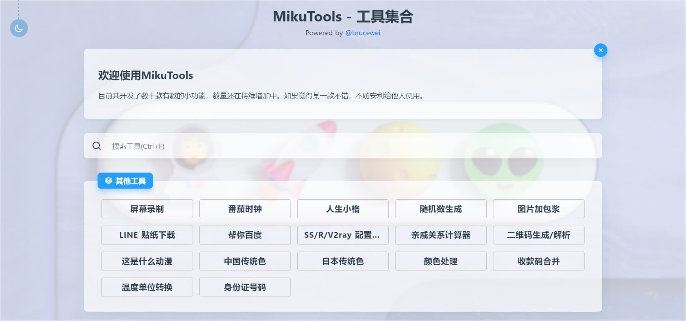

<p align="center"></p>
<h1 align="center">Miku Tools</h1>
<p align="center">一个轻量的工具集合</p>
<p align="center">
    <a href="https://github.com/brusw/MikuTools/blob/master/LICENSE">
        
    </a>
    <a href="https://vuejs.org">
        
    </a>
    <a href="https://brusw.com">
        
    </a>
    <a href="https://tools.brusw.com">
        
    </a>
</p>

## 预览



## 开发

```bash
pnpm install
pnpm dev
```

## 部署

```bash
docker build -t brusw/tools .
docker run --name=brusw-tools -p 8000:8000 -d brusw/tools
```

## 其他

Q：我应该如何添加新功能？
A：参考 `/pages/*.vue` 中的文件新建页面，善用 **CTRL+F** 进行相关模块的查找，然后在 `/tools/index.js` 里添加相关的工具信息。

Q：MikuTools 的主要技术栈是什么？
A：Vue 全家桶 + [Nuxt.js](https://zh.nuxtjs.org/)。

## License

[MIT](https://github.com/brusw/MikuTools/blob/master/LICENSE)
